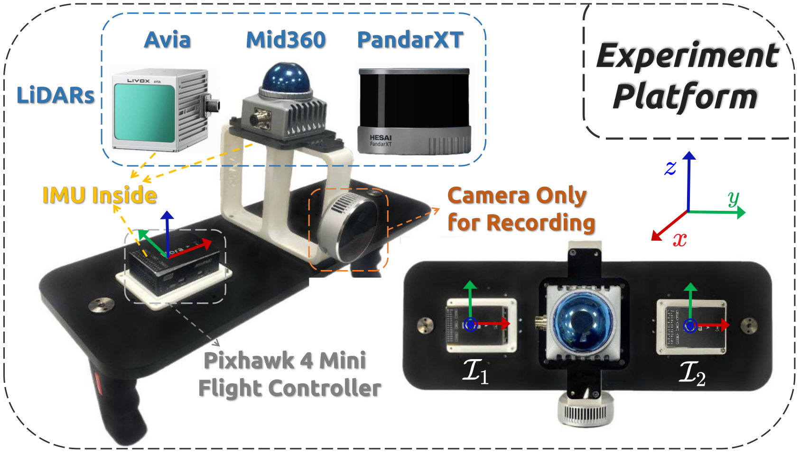

## Robust and Online LiDAR-inertial Initialization

**LI-Init** is a robust, online initialization method for LiDAR-inertial system. The proposed method calibrates the temporal offset and extrinsic parameter between LiDARs and IMUs, and also the gravity vector and IMU bias. Our method does not require any target or extra sensor, specific structured environment, prior environment point map or initial values of extrinsic and time offset. Our package address following key issues:

1. A robust LiDAR odometry (**Fast LO**) modified from FAST-LIO2.
2. Fast and robust **temporal offset and extrinsic parameter calibration** between LiDAR and IMU without any hardware setup.
3. Support **multiple LiDAR types**: both mechanical spinning LiDAR (Hesai, Velodyne, Ouster) and solid-state LiDAR ( Livox Avia/Mid360)
4. Seamlessly merged into FAST-LIO2, as a robust initialization module.

**Contributors**: [Fangcheng Zhu 朱方程](https://github.com/zfc-zfc)， [Yunfan Ren 任云帆](https://github.com/RENyunfan)， [Wei Xu 徐威](https://github.com/XW-HKU)， [Yixi Cai 蔡逸熙](https://github.com/Ecstasy-EC)

### Sensor Suite

<div align="center"></div>


### Pipeline

<div align="center"></div>


### Experiment Result

<div align="center"></div>


<div align="center"></div>


### Related Paper

our related papers are now available on **arxiv**:  [Robust Real-time LiDAR-inertial Initialization](https://arxiv.org/abs/2202.11006)

If our code is used in your project, please cite our paper following the bibtex below:
```
@article{zhu2022robust,
  title={Robust Real-time LiDAR-inertial Initialization},
  author={Zhu, Fangcheng and Ren, Yunfan and Zhang, Fu},
  journal={arXiv preprint arXiv:2202.11006},
  year={2022}
}
```

### Related video:

our accompanying videos are now available on **YouTube** (click below images to open) and [Bilibili](https://www.bilibili.com/video/BV173411j7ia?spm_id_from=333.999.0.0).

<div align="center">
    <a href="https://www.youtube.com/watch?v=WiHgcPpKwvU" target="_blank">
    
</div>


## Codes & Datasets

Our code and test datasets would be released once our paper get accepted.
Thanks for your patience.

## Acknowledgments
Thanks for [HKU MaRS Lab](https://github.com/hku-mars),  [Fast-LIO2](https://github.com/hku-mars/FAST_LIO) (Fast Direct LiDAR-inertial Odometry) and [ikd-tree](https://github.com/hku-mars/ikd-Tree).

Thanks for [Livox Technology](https://www.livoxtech.com/) for equipment support.

